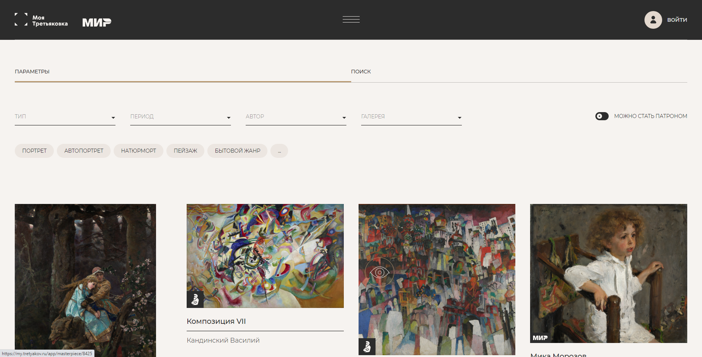

# Tretyakov-Gallery-test
Тестовое задание для Третьяковской Галереи

## Задание

## Описание

Фронтендную часть задания требуется написать с помощью фреймворка Nuxt, бек на PHP и MySQL.

### Страница

Требуется реализовать страницу с виртуальной галереей примерно как в представленном скриншоте. 

### Фильтр

Реализовать несколько фильтров, критерии на ваш выбор.

### Роутинг

Реализовать роутинг с помощью фреймворка nuxt-routing между типами произведений (Живопись, скульптура итд…)

### Бэк

Создайте БД с хранением произведений, и реализуйте бек для получение данных.

### Админка

Реализовать логику админки в UI. Логику авторизации не нужно реализовывать, просто задайте переменную где будет указываться роль при инициализации приложения например role = user | admin. 

Если роль админ, то, например, при наведении на произведение будет появляться шестеренка, нажав на которую можно будет исправить данные, например название, автора и тд.

## Стек

- Frontend
    - Vue/Nuxt
    - Vuex

- Backend
    - PHP
    - MySQL

## Запуск проекта

- Билд проекта `docker-compose build`
- Запуск проекта `docker-compose up`
- После загрузки и инициализации всех контейнеров можно сдампить БД ` cat dump.sql | docker exec -i db mysql -u root --password=r12345678 tretyakov_gallery`
- Бэк доступен по адресу `localhost:8000`
- Фронт доступен по адресу `localhost:3000`

## Архитектура проекта

 - Docker контейнер Nuxt -> `port: 3000`
 - Docker контейнер MYSQL -> `port: 3306`
 - Docker контейнер Apache + PHP -> `port: 8000`
